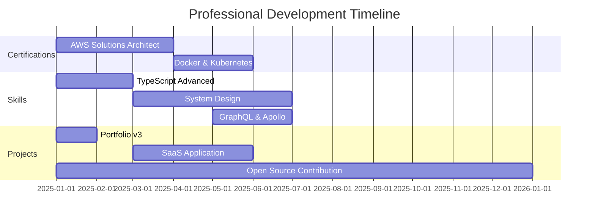

  

  
  
  

---

## 👨‍💻 

**Full-Stack Software Developer** | **B.Sc. Computer Science** (In Progress)  
📍 Kigali, Rwanda 🇷🇼  
🎓 Adventist University of Central Africa (AUCA)

### 🎯 Current Focus & Expertise

<table>
<tr>
<td width="50%" valign="top">

**Backend Engineering**
-  Node.js & Express
-  Spring Boot & Java
-  RESTful API Design

**Database Architecture**
-  MongoDB
-  PostgreSQL
-  MySQL

</td>
<td width="50%" valign="top">

**Frontend Development**
-  React & Hooks
-  TypeScript
-  Modern UI/UX

**Cloud & DevOps**
-  Amazon Web Services
-  Docker Containers
-  CI/CD Pipelines

</td>
</tr>
</table>

---

## 🎯 2025 Progress Tracker

### **Quarterly Milestones (Q4 2025)**

✅ **Completed:** EcoTravels Platform Launch, Glen Producer MVP  
🔄 **completed:** Agri Oasis Harvest, Personal Portfolio v3  
📅 **Upcoming:** Cloud Migration Project, AI Integration Module

---

## 🛠️ Technical Expertise & Skills

### **Programming Languages & Frameworks**

<table>
<tr>
<td align="center" width="20%">

**95%**
 

</td>
<td align="center" width="20%">

**95%**
 

</td>
<td align="center" width="20%">

**85%**
 

</td>
<td align="center" width="20%">

**90%**
 

</td>
<td align="center" width="20%">

**90%**
 

</td>
</tr>
<tr>
<td align="center" width="20%">

**85%**
 

</td>
<td align="center" width="20%">

**87%**
 

</td>
<td align="center" width="20%">

**87%**
 

</td>
<td align="center" width="20%">

**60%**
 

</td>
<td align="center" width="20%">

**70%**
 

</td>
</tr>
</table>

### **Most Used Languages (GitHub Analytics)**

### **Detailed Language Usage Stats**

<b>🎨 Frontend Development Stack</b>

 

**Core Competencies:**
- ⚛️ React Hooks & Context API
- 🎨 Responsive Design & Mobile-First Approach
- 🔄 State Management (Redux, Context)
- 🎭 Component Architecture & Reusability
- ⚡ Performance Optimization & Lazy Loading
- 🎯 Accessibility (WCAG Standards)

<b>⚙️ Backend Development Stack</b>

 

**Core Competencies:**
- 🔌 RESTful API Design & Development
- 🏗️ Microservices Architecture
- 🔐 Authentication & Authorization (JWT, OAuth)
- 📡 WebSocket & Real-time Communication
- 🧪 Unit Testing & Integration Testing
- 📊 API Documentation (Swagger/OpenAPI)

<b>🗄️ Database Management</b>

 

**Core Competencies:**
- 📐 Database Design & Normalization
- ⚡ Query Optimization & Indexing
- 🔄 Data Migration & ETL Processes
- 💾 Backup & Recovery Strategies
- 🔍 NoSQL vs SQL Architecture Decisions
- 📝 Advanced SQL & PL/SQL

<b>🔧 Development Tools & Platforms</b>

 

---

## 🚀 Featured Projects

| Project | Description | Tech Stack | Status | Links |
|---------|-------------|------------|--------|-------|
| 🌍 **EcoTravels** | Eco-friendly travel booking platform with real-time availability | React, Node.js, MongoDB | ✅ Live | [View →](https://github.com/niyonshimirajeanmarie/ecotravels) |
| 🎵 **Glen Producer** | Music producer platform with payment integration | React, Express, Stripe | ✅ Live | [View →](https://github.com/niyonshimirajeanmarie/glen-producer) |
| 🌾 **Agri Oasis Harvest** | Smart farming management system | Spring Boot, PostgreSQL | 🔄 Development | [View →](https://github.com/niyonshimirajeanmarie/agri-oasis-harvest) |

[**📂 View All Projects →**](https://github.com/niyonshimirajeanmarie?tab=repositories)

---

## 📊 GitHub Analytics

  
  

  

### 📈 Contribution Activity

---

## 🏆 Achievements & Metrics

### **Career Milestones**

| Achievement | Date | Description |
|-------------|------|-------------|
| 🎓 **First Commercial Project** | Jan 2024 | Launched EcoTravels booking platform |
| ⭐ **100 GitHub Stars** | Mar 2024 | Reached 100 total stars across repositories |
| 🤝 **Open Source Contributor** | Jun 2024 | First contribution accepted to major project |
| 💼 **Freelance Developer** | Sep 2024 | Started professional freelance work |

### **Coding Stats**

---

## 📚 Learning Roadmap 2025

---

## 💼 Professional Information

**Available for:**
- 💻 Freelance Projects (Full-Stack Development)
- 🤝 Open Source Collaborations
- 👨‍🏫 Technical Mentorship
- 📝 Technical Writing & Content Creation

**Working Hours:** Monday - Saturday, 9:00 AM - 6:00 PM (GMT+2)  
**Response Time:** Within 24 hours

---

## 📬 Connect With Me

**Preferred Contact:** Email or LinkedIn for professional inquiries

---

### 💡 Quote That Drives Me

> *"The only way to do great work is to love what you do. Stay hungry, stay foolish."*  
> — **Steve Jobs**

---

### 📊 Last Updated: November 2025

---

**⭐ If you find my work valuable, consider starring my repositories!**

